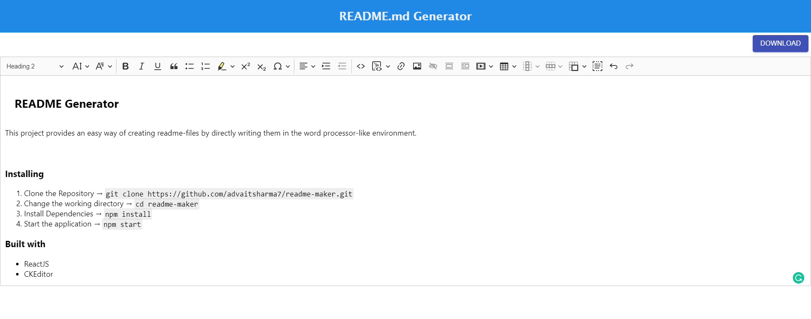

## README Generator

This project provides an easy way of creating readme-files by directly writing them in the word processor-like environment.

### Installing

1.  Clone the Repository → `git clone https://github.com/advaitsharma7/readme-maker.git`
2.  Change the working directory → `cd readme-maker`
3.  Install Dependencies → `npm install`
4.  Start the application → `npm start`

### Screenshot

### Built with

- ReactJS
- CKEditor
